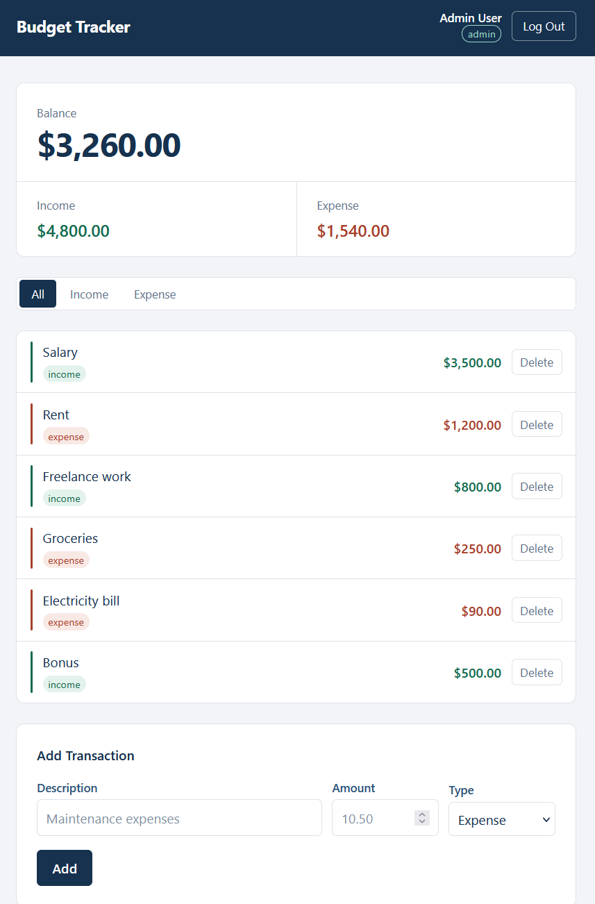
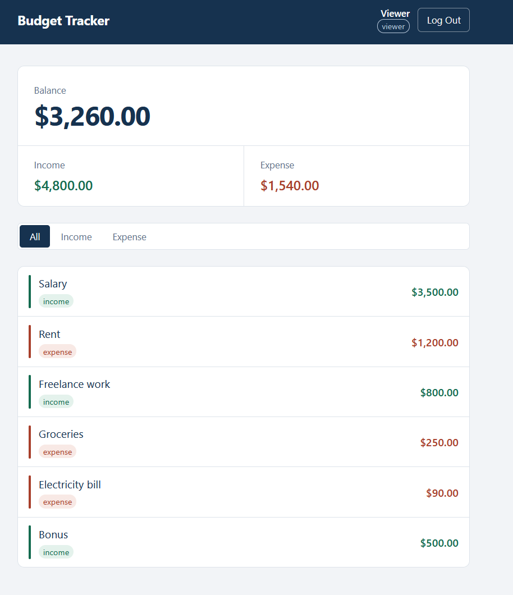

# Budget Tracker

React app for tracking income and expenses, with role-based access.

Two contexts to hold the states: one for authentication and one for the transactions.

The logged-in user is kept in `localStorage` so a logged in user survives a page refresh.

Built for the assignment **Advanced State Management**.

**Admin**

**Viewer**

## Features

- **Login:** a form with username and password, validated against two mock users (`admin` and `viewer`). A failed attempt shows "Incorrect username or password." and leaves the form as it was. Password is not checked and can be any value.
- **Session persistence:** the logged-in user is saved to `localStorage` on login and read back on mount. Logging out clears the stored user.
- **Loading state:** a neutral "Loading..." message replaces the app while `localStorage` is being checked.
- **Header:** shows the app name, the logged-in user's name, a role badge, and a Log Out button.
- **Summary:** total balance, total income, and total expenses, each formatted as SGD currency. The totals are calculated from the full transaction list, so they do not change when a filter is applied. Income and Expense is coloured differently.
- **Status filter:** All / Income / Expense. The filtered list is derived during render from the transactions array and the current filter. The active button is highlighted.
- **Transaction list:** each row shows the description, a type badge, and the amount, with a coloured stripe on the left edge marking income (green) or expense (red). An empty list shows a message appropriate for the current the filter.
- **Add transactions:** a controlled form with description, amount, and a type selector with two options (Income or Expense). The amount is validated before it is dispatched, and the form clears once the transaction is added.
- **Delete transactions:** each row has a Delete button that removes that transaction by id.
- **Role-based access:** the Add form and the Delete buttons are only rendered for admin users. Viewers see the same data with no way to change it.
